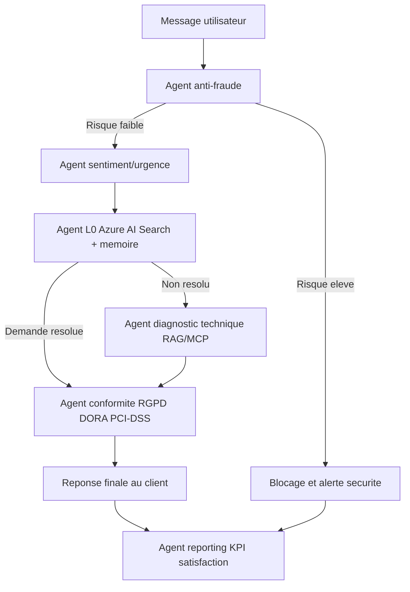
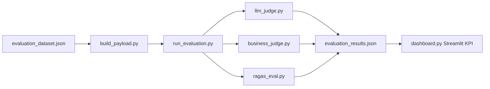

# Bonjour, je suis Cynthia Sileu Kapnang 👋

## Data Engineer | GenAI Engineer | Azure Databricks

📞 +33 6 25 86 16 89

[](https://www.linkedin.com/in/cynthia-sileu-kapnang-7484b4206)
[](https://github.com/cyndikap)
[](#objectif-professionnel)

---
## Stack Principale

Python • PySpark • SQL • Apache AIRFLOW • Kafka • DAG • Pipeline ETL • Azure Databricks • MLflow • Unity Catalog • Azure OpenAI • RAG • LLM • FastAPI • Streamlit
---
## Présentation

Data Engineer spécialisée en Intelligence Artificielle Générative, actuellement en alternance chez Capgemini (Insight & Data), où je contribue au développement et au déploiement de solutions Data & IA à grande échelle.

Mon expertise couvre la mise en place de pipelines data et IA, l'industrialisation de cas d'usage **RAG**, l'intégration de **LLM**, et la conception d'**architectures multi-agents** sur le **Cloud Azure**.

🎯 Positionnement : transformer des enjeux métier complexes en produits data & IA fiables, gouvernés et déployables à l'échelle.

---

## Compétences Techniques

### Data Engineering
- Python
- PySpark
- SQL
- Apache AIRFLOW
- Kafka
- DAG
- Pipeline ETL
- Azure Databricks
- MLflow
- Unity Catalog

### Intelligence Artificielle
- Azure OpenAI
- Claude
- LLM
- RAG
- Prompt Engineering
- Agents IA
- Systèmes Multi-Agents

### Cloud & APIs
- Azure
- AWS
- FastAPI
- REST API

### Visualisation
- Power BI
- Streamlit

---
## Expérience

### Capgemini | Data Engineer (Alternance)
📅 Septembre 2025 - Septembre 2026

- Déploiement de solutions GenAI sur Azure Databricks
- Conception d'architectures RAG et multi-agents
- Industrialisation de modèles IA avec MLflow
- Mise en place de pipelines Data Engineering
- Gouvernance des données avec Unity Catalog

---
## Projets Principaux

### Projet RAISE
**Objectif**
- Industrialiser des cas d'usage conversationnels GenAI pour accélérer l'accès à l'information et améliorer la productivité.

**Problématique**
- Passer d'un prototype IA à une solution scalable, traçable et gouvernée.

**Technologies**
- Azure Databricks, MLflow, Unity Catalog, Model Serving, Python, RAG, LLM.

**Résultats obtenus**
- Déploiement de chatbots GenAI en environnement maîtrisé.
- Amélioration de la traçabilité des modèles et des versions.
- Renforcement de la gouvernance des actifs data & IA.

**Compétences mobilisées**
- Data Engineering, MLOps, GenAI Ops, gouvernance data, architecture cloud.

### Projet AELON
**Objectif**
- Concevoir une plateforme bancaire multi-agents orientée assistance métier et recherche de connaissances.

**Problématique**
- Orchestrer plusieurs agents IA spécialisés tout en conservant performance, fiabilité et sécurité.

**Technologies**
- Azure OpenAI, RAG, FastAPI, Python, architecture multi-agents.

**Résultats obtenus**
- Mise en place d'une architecture modulaire d'agents.
- Meilleure précision des réponses via contextualisation RAG.
- Accélération de la conception de cas d'usage IA côté métier.

**Compétences mobilisées**
- GenAI Engineering, API Engineering, architecture applicative, prompt engineering.

**Agents conçus (AELON)**

| Fonction | Business value | Données | Types de données |
|---|---|---|---|
| Premier niveau de support: recherche dans la base de connaissances Azure AI Search + mémoire des échanges passés | Résout automatiquement les demandes courantes sans intervention humaine, réduction du coût de support | Oui | Requête utilisateur, chunks Azure AI Search, historique mémoire L0 (`L0_memory.json`) |
| Diagnostic technique avancé: interrogation des logs via RAG + pilotage du cycle de vie MCP | Traite les cas non résolus par L0 et fournit une analyse technique des incidents | Oui | Contexte d'escalade L0, logs système (RAG/MCP), réponse LLM multilingue |
| Analyse avant traitement: détection par mots-clés (phishing, OTP, carte) + confirmation LLM | Bloque les tentatives de fraude, phishing et usurpation d'identité en temps réel | Oui | Message utilisateur, patterns de fraude prédéfinis, réponse LLM JSON (`is_fraud`, `risk_level`, `reason`) |
| Analyse du ton émotionnel (frustration, urgence, colère) avant L0 | Priorise les clients en détresse, adapte le ton de réponse et réduit le churn | Oui | Message utilisateur, score de sentiment (positif, négatif, neutre), niveau d'urgence |
| Vérification de conformité des réponses générées (RGPD, DORA, PCI-DSS) | Réduit le risque légal et réglementaire et alimente un audit trail automatique | Oui | Réponse générée, règles de conformité, checklist réglementaire |
| Résumé des problèmes rencontrés + dashboards KPI satisfaction clients | Permet l'amélioration continue de la plateforme côté métier | Oui | Requêtes utilisateurs, temps de réponse, taux de résolution, signaux de satisfaction |

Cette architecture permet de couvrir la qualité de service bout en bout: automatisation L0, sécurité/fraude, diagnostic technique, conformité et pilotage KPI.

**Architecture multi-agents (flux décisionnel)**



**AELON - Synthese fonctionnelle et technique**

**Contexte metier**
- Modernisation du support bancaire pour gerer un volume croissant de demandes clients.
- Exigence de reponses rapides, personnalisees et fiables, 24/7.
- Respect obligatoire des contraintes de securite et conformite (RGPD, DORA, PCI-DSS).

**Objectifs du projet**
- Automatiser le support bancaire sur les demandes recurrentes.
- Renforcer la detection de fraude et la protection des donnees sensibles.
- Garantir la conformite reglementaire des reponses generees.
- Exploiter l'IA generative (Azure OpenAI + RAG) pour des reponses contextualisees.
- Piloter la performance avec des KPI metier, techniques et IA.

**Acteurs de la plateforme**
- Clients bancaires (utilisateurs finaux).
- Equipes metier (pilotage de la qualite de service).
- Equipes Data & IA (developpement, monitoring, amelioration continue).
- Agents IA specialises (Privacy, Fraud, Sentiment, L0, L1, Retrieval, Compliance, Explainability, Observability, Analytics, Evaluation).

**Besoins fonctionnels couverts**
- Support conversationnel bancaire intelligent (comptes, paiements, cartes, incidents).
- Detection de fraude en amont de tout traitement.
- Analyse emotionnelle et gestion de l'urgence.
- Gestion des escalades L0 vers L1 sur les cas complexes.
- Production de dashboards analytiques pour les equipes metier.

**Besoins non fonctionnels**
- Securite: anonymisation, controle d'acces, prevention fraude, conformite.
- Disponibilite: service continu, monitoring, reprise sur incident.
- Scalabilite: architecture cloud et traitements distribues.
- Performance: faible latence de reponse et traitement efficace.
- Maintenabilite: architecture modulaire multi-agents.
- Gouvernance: tracabilite, auditabilite, explicabilite et supervision continue.

**Architecture Data Engineering (Databricks Lakehouse)**
- Bronze: donnees brutes (conversations, logs, evenements, sorties agents).
- Silver: donnees nettoyees, anonymisees et enrichies (fraude, sentiment, urgence, categories).
- Gold: indicateurs agreges pour dashboards et decision.
- Delta Lake: versioning, historisation, controle qualite, audit.
- PySpark: nettoyage, enrichissement, agregations, traitements distribues.

**KPI suivis**
- KPI clients: volume interactions, satisfaction, repartition des sentiments, categories de demandes.
- KPI agents: taux de resolution, taux d'escalade, performance par agent, volume traite.
- KPI securite: fraudes detectees, score de risque moyen, alertes.
- KPI IA: quality score, temps moyen de reponse, taux de conformite, explicabilite.

Cette synthese formalise les chapitres metier, architecture et gouvernance d'AELON dans un format directement exploitable dans le portfolio.

### Projet SAV GENIA
**Objectif**
- Créer une plateforme d'évaluation fiable des agents IA pour piloter la qualité des réponses.

**Problématique**
- Évaluer objectivement la performance de systèmes GenAI avec des métriques techniques et métier.

**Technologies**
- LLM-as-a-Judge, Business Judge, RAGAS, Streamlit, Python.

**Résultats obtenus**
- Industrialisation d'un pipeline d'évaluation multi-critères.
- Clarification des axes d'amélioration des prompts et des agents.
- Meilleure comparabilité des versions de systèmes IA.

**Compétences mobilisées**
- Evaluation Frameworks, GenAI Quality, data storytelling, développement d'outils analytiques.

**Module développé : EVALUATION AGENTS GENIA-SAV**
- Mise en place du pipeline du module d'évaluation.
- Structuration des composants d'évaluation techniques et métier.

**Structure du module d'évaluation**

| Fichier | Rôle | Observation |
|---|---|---|
| `evaluation_dataset.json` | Contient les questions de test. | Jeu de cas utilisé pour la comparaison des réponses. |
| `build_payload.py` | Crée l'objet envoyé aux juges. | Prépare les entrées standardisées pour tous les évaluateurs. |
| `llm_judge.py` | Mesure la qualité de la réponse. | Mesures : exactitude, complétude, absence d'erreur (LLM-as-a-Judge / correctness). |
| `business_judge.py` | Vérifie l'exploitabilité métier de la réponse. | Exemple "Carte perdue" : la réponse doit couvrir opposition et renouvellement, sinon score faible. |
| `ragas_eval.py` | Mesure la qualité du retrieval. | Métriques recommandées : faithfulness, context recall, context precision. |
| `run_evaluation.py` | Orchestre toute l'évaluation. | Lance la chaîne complète du module. |
| `evaluation_results.json` | Sauvegarde les scores. | Résultats consolidés pour analyse. |
| `dashboard.py` | Affiche les KPI avec Streamlit. | Suivi visuel des performances du module. |

Ces métriques sont alignées avec l'approche du document `Pipeline_Evaluation_RAG` et permettent d'évaluer à la fois la qualité de la réponse, la qualité du retrieval et la pertinence métier.

**Vérification du module évaluation (PowerShell)**

```powershell
python .\run_evaluation.py
```

**Architecture du module évaluation**



### Projet Data Quality IA - RATP
**Objectif**
- Automatiser des contrôles de qualité des données avec des agents IA dédiés à la gouvernance.

**Problématique**
- Réduire la détection tardive des anomalies et fiabiliser les usages data métiers.

**Technologies**
- Python, PySpark, Azure Databricks, agents IA, règles de qualité des données.

**Résultats obtenus**
- Détection plus rapide des anomalies critiques.
- Structuration des règles de gouvernance data.
- Contribution à une meilleure confiance dans les jeux de données.

**Compétences mobilisées**
- Data Quality, Data Governance, Data Engineering, IA appliquée.

### Hackathon Anthropic
**Objectif**
- Développer un assistant de recommandation automobile conversationnel.

**Problématique**
- Produire des recommandations pertinentes en tenant compte de contraintes utilisateur variées.

**Technologies**
- Claude, Python, logique de recommandation, interface conversationnelle.

**Résultats obtenus**
- Prototype fonctionnel présenté en contexte hackathon.
- Démonstration d'une capacité de réponse contextualisée.
- Validation d'approches prompt-driven pour recommandations métier.

**Compétences mobilisées**
- Prompt engineering, prototypage rapide, GenAI application design.

---

## Certifications & Accréditations

### PIM Implementation Consultant - Intermediate (Syndigo)
[](https://www.credly.com/badges/55da860c-f963-491f-8770-5570d8233255)
- **Description** : certification orientée implémentation PIM et gestion de données produits dans un contexte Master Data Management.
- **Compétences validées** : Master Data Management, PIM implementation, qualité et structuration des données produit.
- **Lien de vérification** : [PIM Implementation Consultant - Intermediate - Credly](https://www.credly.com/badges/55da860c-f963-491f-8770-5570d8233255)

### Databricks Fundamentals Accreditation - Databricks Academy (2026)

- **Description** : fondamentaux de la plateforme Databricks et de l'approche Lakehouse.
- **Compétences validées** : Spark ecosystem, architecture Lakehouse, bonnes pratiques Databricks.

### AI Practitioner - IA Générative & Agents IA (2026)

- **Description** : conception de solutions d'IA générative orientées production.
- **Compétences validées** : agents IA, prompt engineering, architecture GenAI.

### AI Explorer - IA Générative (2026)

- **Description** : exploration des usages et limites des modèles génératifs.
- **Compétences validées** : LLM, cas d'usage RAG, cadrage de solutions IA.

### Microsoft Power BI Data Analyst Associate

- **Description** : certification d'analyse et visualisation de données avec Power BI.
- **Compétences validées** : modélisation BI, DAX, tableaux de bord, communication visuelle.

### Google Cloud Platform Fundamentals

- **Description** : bases du cloud public et des services data GCP.
- **Compétences validées** : culture cloud, principes d'architecture, services managés.

### ETL and Data Pipelines with Shell, Apache AIRFLOW and Kafka

- **Description** : construction de pipelines ETL orchestrés et résilients.
- **Compétences validées** : orchestration Apache AIRFLOW, flux Kafka, automatisation shell.

### Hackathon Anthropic - Claude AI

- **Description** : prototypage d'un assistant IA en contexte compétitif.
- **Compétences validées** : innovation rapide, design conversationnel, itération produit.

---

## Stack Technique


---

## Objectif Professionnel

**🎯 En tant que Data Engineer, GenAI Engineer ou AI Engineer.
Je souhaite contribuer à la conception et à l'industrialisation de solutions Data & IA à fort impact au sein d'équipes innovantes.**

Je souhaite contribuer a des projets a fort impact au sein d'environnements innovants (Capgemini, Accenture, BNP Paribas, Societe Generale, Airbus et autres acteurs Data & IA), avec une approche orientee valeur metier, excellence technique et industrialisation.

---

## Contact

- Téléphone : +33 6 25 86 16 89
- LinkedIn : [linkedin.com/in/cynthia-sileu-kapnang-7484b4206](https://www.linkedin.com/in/cynthia-sileu-kapnang-7484b4206)
- GitHub : [github.com/cyndikap](https://github.com/cyndikap)
- Email : kapnangcynthia@gmail.com

---
## GitHub Analytics

https://github-readme-stats.vercel.app/api?username=cyndikap&show_icons=true&theme=default

![Top Langs](https://github.vercel.app/api/top-langs/?username=cyndikap&layout=compact

---
> Merci pour votre visite. N'hesitez pas a me contacter pour echanger autour d'opportunites Data, IA Generative et Cloud.